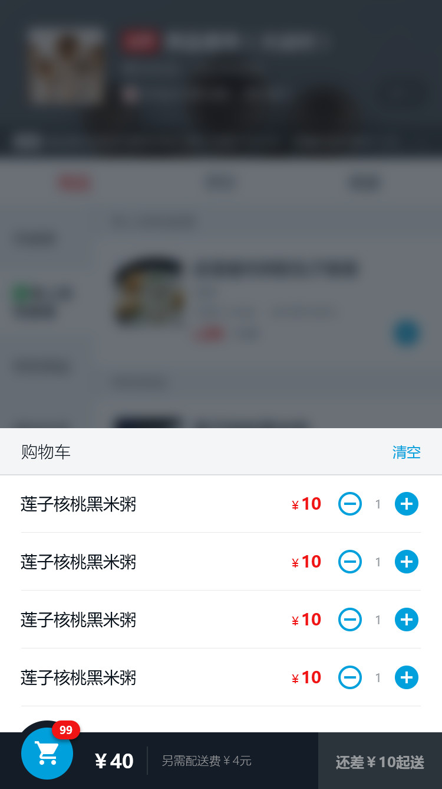
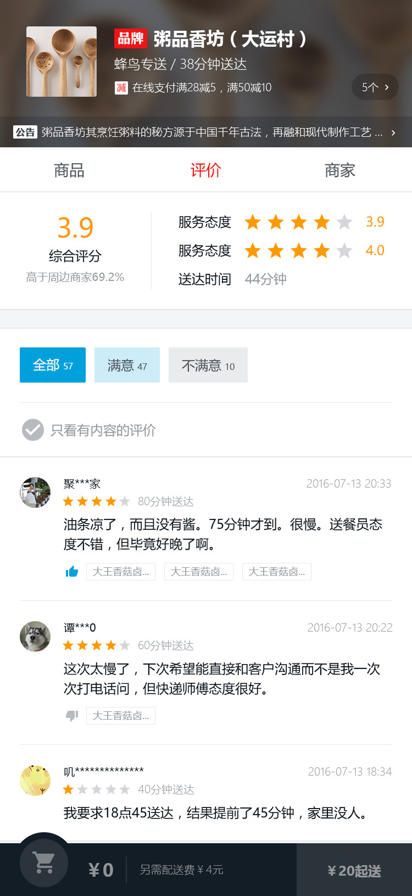

## 高仿”饿了吗”外卖App

## 项目描述

  * 此项目为外卖App核心的商家模块的SPA(单页面应用)
  * 包括商品、评论、商家介绍、购物车等多个子模块
  * 使用Vuejs全家桶+ES6+Webpack等前端最新最热的技术
  * 采用模块化、组件化、工程化的模式开发
## 项目功能界面
  * 商品页
   
  * 商品页_公告及优惠信息
   
  * 商品页_购物车详情
    
  * 商品页_商品详情
    
  * 评论页
    
  * 商家页
    
## 技术选型
  * 前台数据处理／交互／组件化(vue全家桶)
    * vue
    * vue-cli(脚手架)
    * vue-router
    * vue-resource(axios)
    * vuex
  * 后台处理(mock数据)
    * mockjs
    * express
  * 模块化
    * ES6
    * babel
  * 项目构建／工程化
    * webpack
    * vue-cli
    * eslint
  * css预编译器
    * stylus
  * 滑动库
    * better-scroll
  * 编码规范检查
    * eslint
## 前端路由
  * 商品
    * /goods
    * components/goods/goods.vue
  * 评价
    * /ratings
    * components/ratings/ratings.vue
  * 商家
    * /seller
    * components/seller/seller/seller.vue
## API接口
  * 全称: 前后台交互API接口
  * 重要概念:
    * API(接口)
    * 接口文档
    * 对接口
    * 联调
    * 前后台分离
    * mock数据
  * 接口文档
    * 商家
    * 评价
    * 商品
## vue组件
#### 1.重要概念

  * 模块与组件
    * 模块
      * JS模块
      * 具有特定功能的JS文件
    * 组件
      * 功能组件/模块
      * 是实现界面某个局部功能的所有资源的集合(html/css/js/image等)
    * 联系
      * 一个组件中一般会使用到多个JS模块

  * 模块化/组件化/工程化 
   
    * 这3个概念就是用来描述项目(应用)的
    * 模块化: 项目所有的JS都是一个模块, 一个模块编写的 
    * 组件化: 项目的界面功能是以组件形式编写组合而成的
    * 工程化: 通过项目构建工程实现了项目的自动构建/打包处理
#### 2. vue组件
* 所有的组件都在src/compoents/下
* app.vue 应用的根组件

  * header.vue 页面头部显示商家基本信息的组件
    * star.vue
  * 路由
    * goods.vue 商品分路由组件: 商品列表/购物车相关功能
      * food.vue 商品列表组件: 显示商品分类/商品列表, 购物项加减
      
        * cartcontrol.vue 购物项操作组件: 增加/减少某个购物项的数量
        * ratingselect.vue 商品评论列表组件: 过滤查看商品评价列表
        * split.vue 分隔线小组件
      * shopcart.vue 底部购物车组件: 显示购物项列表及相关操作
        * cartcontrol.vue 购物项操作组件: 增加/减少某个购物项的数量
      * cartcontrol.vue 购物项操作组件: 增加/减少某个购物项的数量
    * ratings.vue 评价分路由组件: 商品评价列表
    
      * star.vue 星级评价组件
      * ratingselect.vue 商品评论列表组件: 过滤查看商品评价列表
      * split.vue 分隔线小组件
    * seller.vue 商家详情分路由组件: 显示商家详情
      * star.vue 星级评价组件
      * split.vue 分隔线小组件
    

# vue_app

> A Vue.js project

## Build Setup

``` bash
# install dependencies
npm install

# serve with hot reload at localhost:8080
npm run dev

# build for production with minification
npm run build

# build for production and view the bundle analyzer report
npm run build --report

# run unit tests
npm run unit

# run e2e tests
npm run e2e

# run all tests
npm test
```

For detailed explanation on how things work, checkout the [guide](http://vuejs-templates.github.io/webpack/) and [docs for vue-loader](http://vuejs.github.io/vue-loader).
